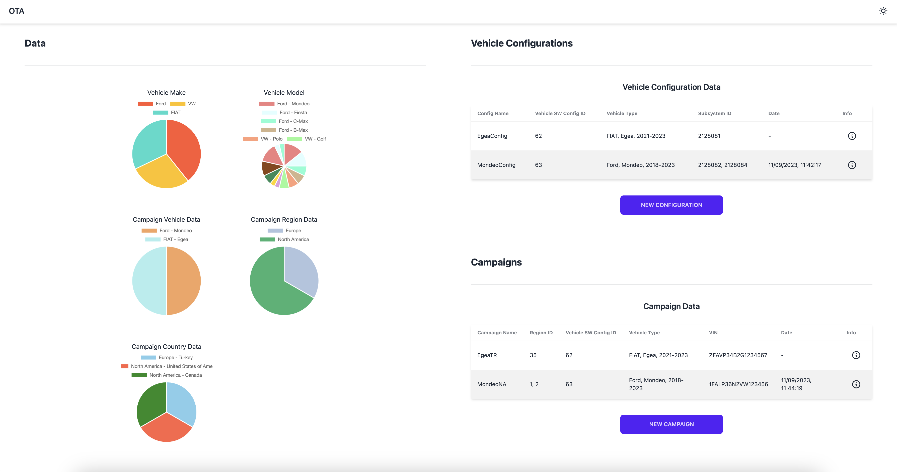
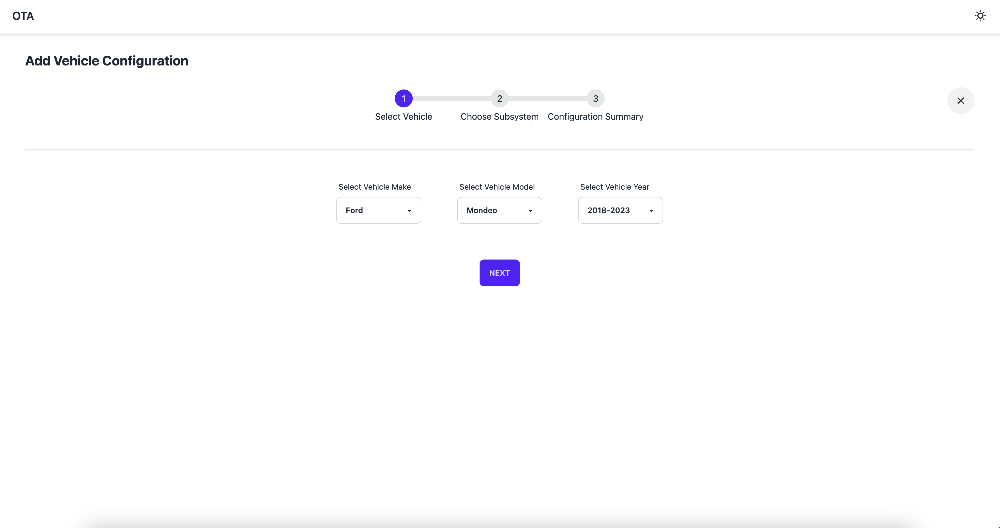
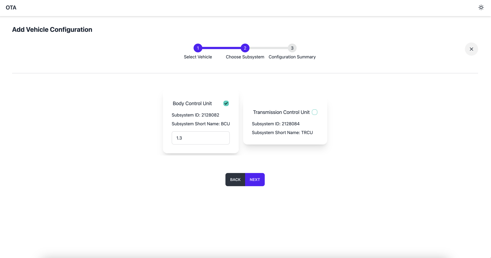
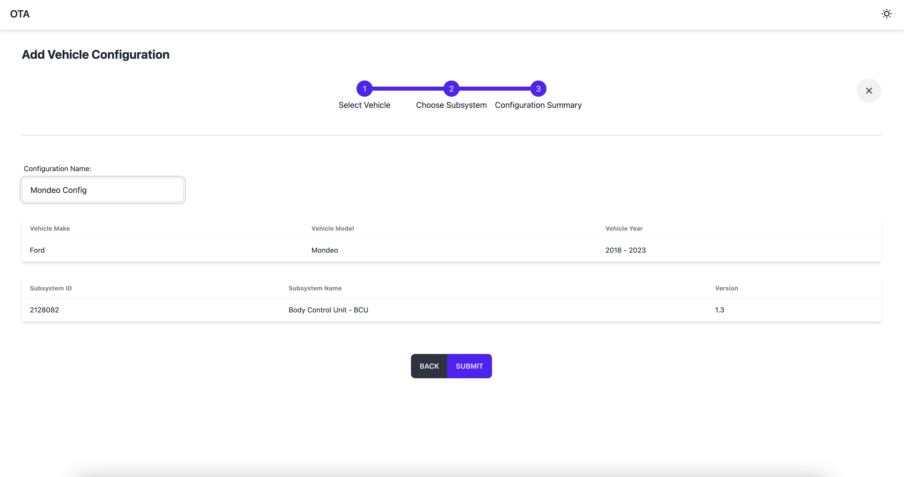
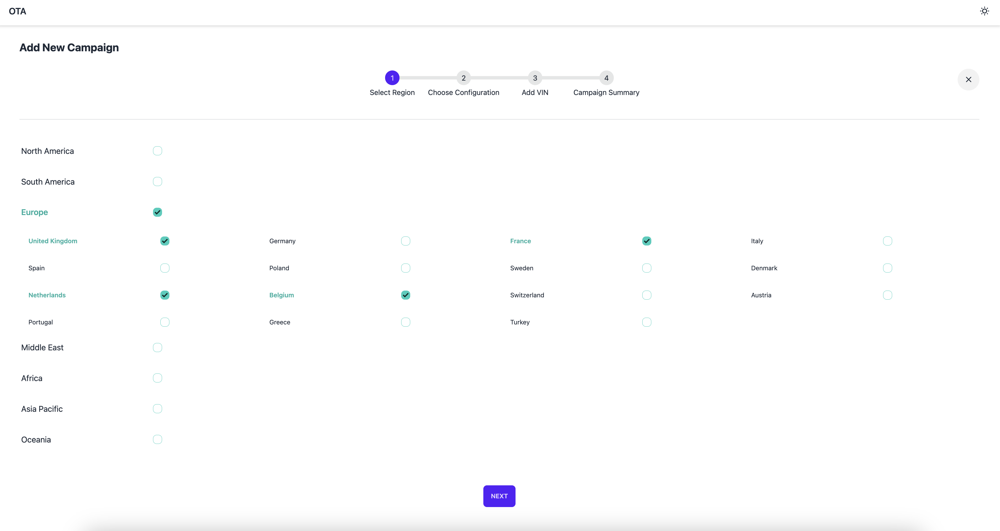
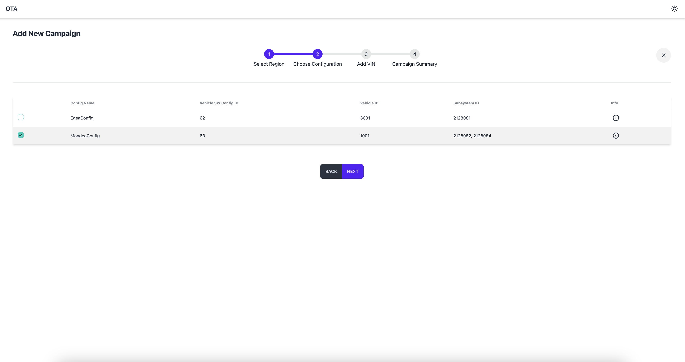
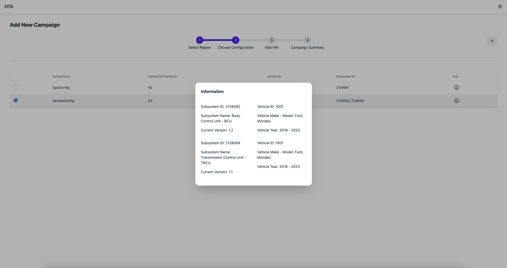
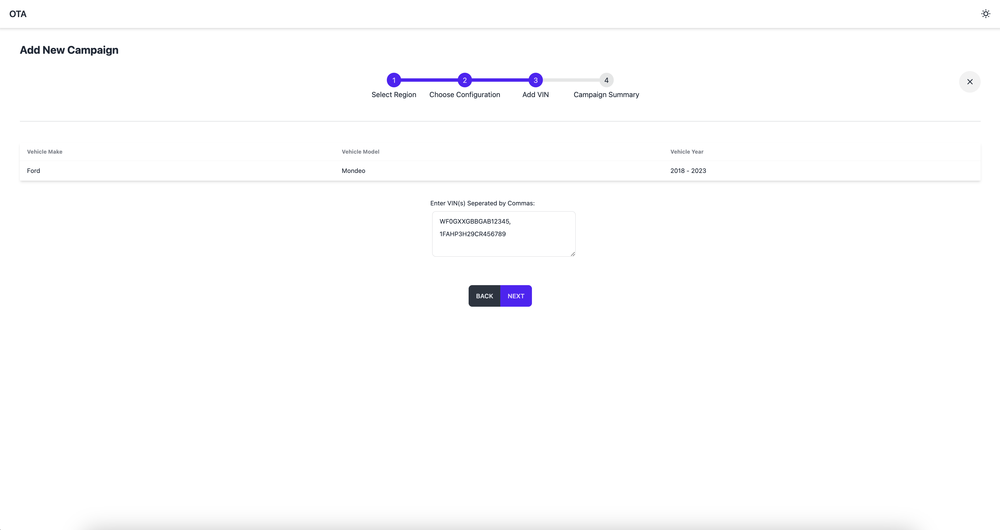
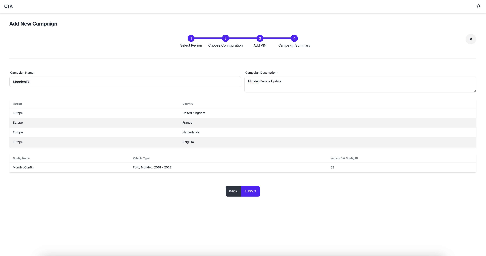

# OTA Project

2023 summer internship project at Vestel Elektronik R&D New Technologies Automotive Group. 
Created a dashboard application which simulates updating vehicle software over the air. 


## Authors

- [@nkozdemir](https://github.com/nkozdemir)


## Tech Stack

**Client:** React, TailwindCSS, daisyUI

**Backend:** AWS RDS, AWS Lambda, AWS API Gateway

**Deployment:** AWS Amplify


## Run Locally

Clone the project

```bash
  git clone https://github.com/nkozdemir/ota-project.git
```

Go to the project directory

```bash
  cd my-project
```

Install dependencies

```bash
  npm install
```

Start the server

```bash
  npm run dev
```


## Environment Variables

To run this project, you will need to add the following environment variables to your .env file

`VITE_API_BASE_URL`

`VITE_API_KEY`


## Screenshots

















